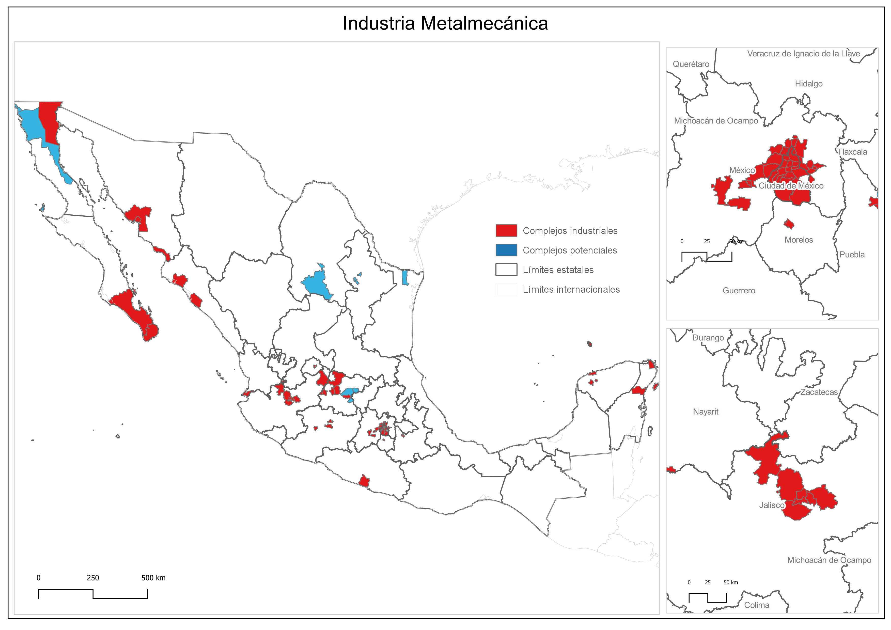
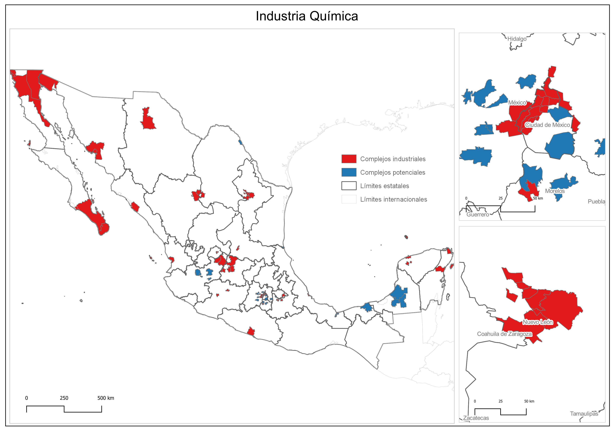
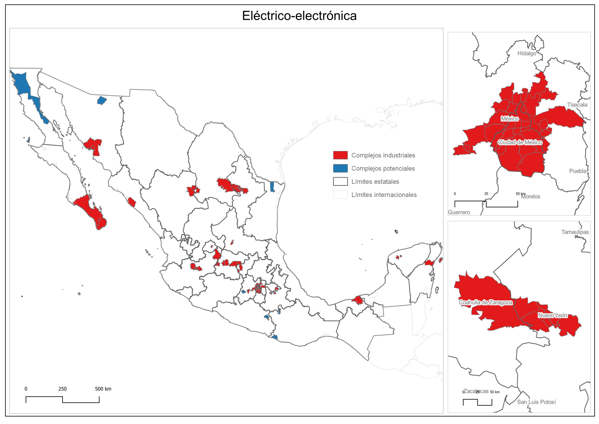
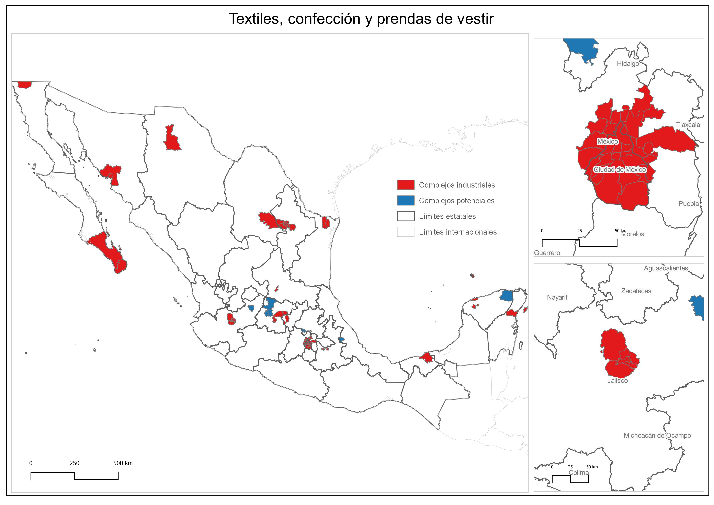
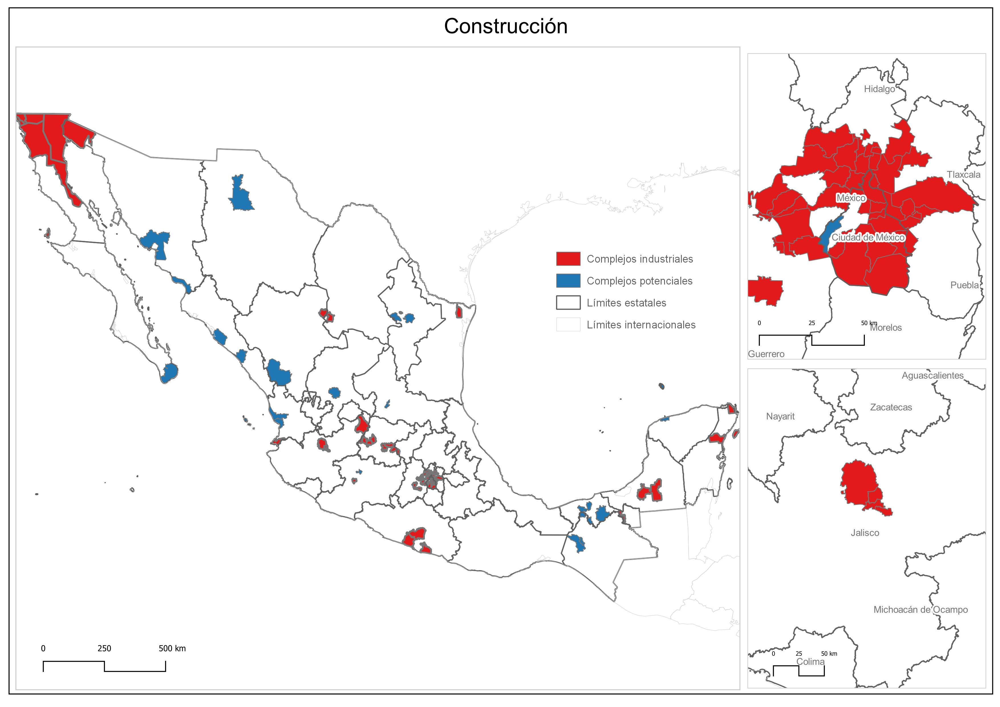
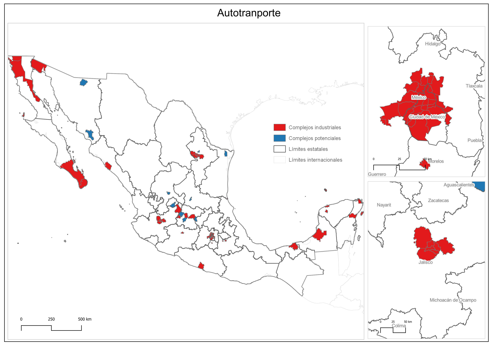
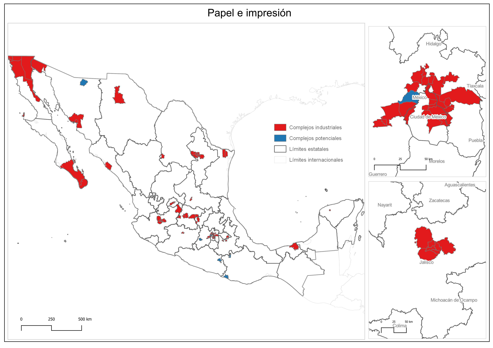
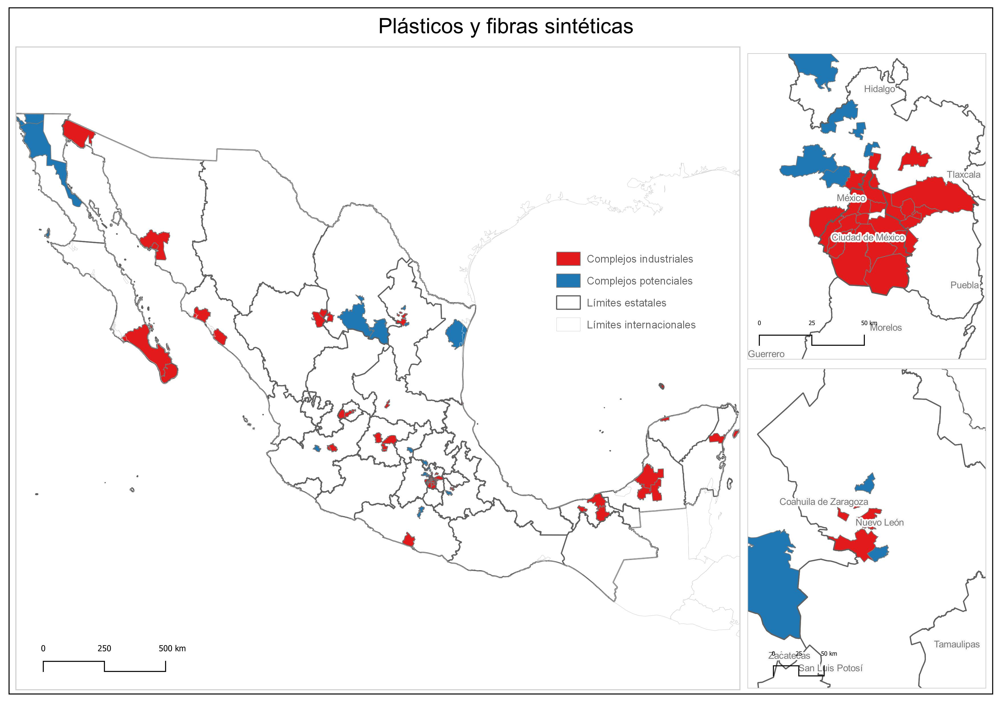
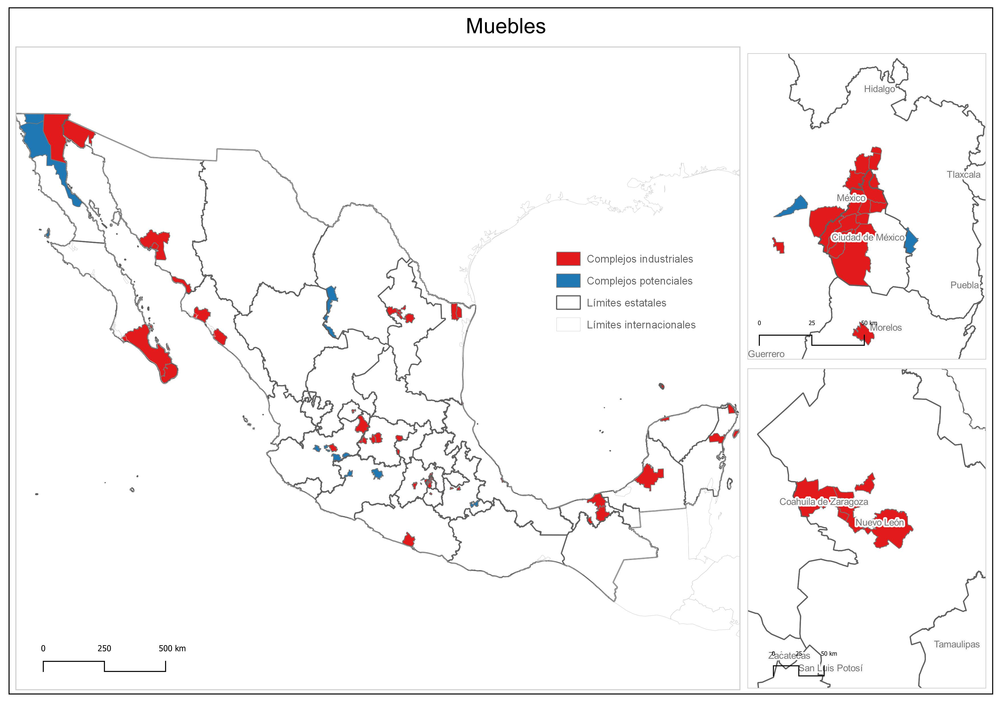

```{r setup, include=FALSE}
knitr::opts_chunk$set(echo = TRUE, warning = FALSE,message = FALSE)
```
# Introducción

Un tema central en las disciplinas regionales ha sido el estudio de las economías de aglomeración, el conjunto de fuerzas que dan forma y configuran el espacio económico (Fischer y Nijkamp, 2014). Dichas fuerzas, que emergen del carácter social y cooperativo del proceso de producción (Marx, 2011: 391-408) y de la división social del trabajo (Scott, 2006), confieren ventajas a las unidades económicas al incrementar la productividad del trabajo y reducir sus costos (Cohen y Paul, 2009).

Las economías de aglomeración se expresan geográficamente como concentraciones espaciales de actividad (Gordon y McCann, 2000: 516). Estas concentraciones son un rasgo característico de la distribución espacial de la actividad económica (World Bank, 2009) y han recibido diferentes denominaciones en la literatura (distritos industriales, complejos industriales, polos industriales, sistemas productivos regionales, sistemas regionales de innovación, clústeres, entre otros).

La diversidad conceptual obedece a, por lo menos, tres aspectos: el periodo histórico en el que los términos fueron acuñados (historicidad), el tipo de unidades económicas vinculadas a la concentración (estructura de propiedad y tamaño) y el conjunto de fenómenos que el concepto busca capturar (nivel de abstracción). No obstante, todos ellos tienen en común que buscan recoger el hecho de que la actividad económica no se distribuye de forma homogénea en el espacio, sino que se concentra (Asuad, 2007).

Desde el concepto marshalliano de distrito industrial que caracterizaba una forma de producción artesanal local que se restringía a distancias que los trabajadores y proveedores podían cubrir diariamente de manera rentable a fines del siglo XIX (Trippl y Bergman, 2021: 449-450) hasta el de clúster industrial regional que se populariza en la década de los noventa debido a la proyección internacional de los trabajos de Porter (1990) sobre estrategias corporativas, mucho se ha escrito sobre este rasgo de la distribución espacial de la actividad económica.

Los gobiernos nacionales y subnacionales de diversos países han impulsado medidas de política económica basadas en el impulso de dichas concentraciones espaciales de actividad económica para promover el desarrollo y reducir las brechas entre regiones (Belussi, 1999; OECD, 1998; WorldBank, 2009). Entre ellas se cuenta la del gobierno de los Estados Unidos que ha financiado el proyecto U.S. Cluster Mapping como “una iniciativa nacional que proporciona datos de libre acceso abiertos sobre clústeres y economías regionales para apoyar al sector empresarial, los procesos de innovación y como instrumento de política” (S.-DCEDA, 2020). No obstante, tanto el concepto de clúster como las medias de política derivadas de ella han recibido críticas por su poca solidez teórico-metodológica y por sus resultados (Martin y Sunley, 2003; Pacheco-Vega, 2007).
Si la diversidad conceptual es amplia, lo es todavía más la de técnicas para su identificación. Este campo ha sido prolífico desde finales de la década de los sesenta del siglo XX (Cruz y Teixeira, 2010) pues incluso dentro del mismo término o perspectiva teórica, la diversidad metodológica es basta (Komorowski 2020). Existe una variedad de técnicas muy amplia que va desde sencillas métricas que captan especialización en una región (O’Donoghue y Gleave, 2004; Kopczewska et al., 2017), hasta métodos que buscan identificar relaciones insumo-producto (Czamanski y Ablas, 1979; Bergaman y Feser, 1999) e incluso relaciones de naturaleza no económica (Delgado et al., 2016).

En este contexto, cobra relevancia un estudio crítico de las técnicas más usuales utilizadas para la identificación de concentraciones espaciales de actividad económica, así como de algunos de los conceptos utilizados para referirse a dichas concentraciones, pues suelen usarse de forma poco cuidadosa y a veces intercambiable (O’Donoghue y Gleave, 2004). La necesidad de tal reflexión es relevante en la medida en que puede contribuir a contar con mejores herramientas de política económica regional que hagan explícita la presencia e importancia del espacio en los fenómenos económicos (Fothergill et al., 2019).

Este trabajo se propone contribuir en la línea previamente descrita a través de los siguientes objetivos: i) analizar críticamente algunos de los conceptos más utilizados en la literatura que refieren los patrones espaciales de concentración de la actividad económica, ii) revisar y contrastar algunos de los métodos más usuales para la identificación de concentraciones espaciales de actividad económica, iii) proponer e ilustrar un método de identificación de concentraciones espaciales de actividad económica bajo la noción de complejos industriales.
En la sección 1 se discuten algunos de los conceptos más comunes para describir los patrones de concentración espacial de la actividad económica en donde se resalta la importancia de distinguir el momento histórico en el que dichos términos son propuestos, así como su alcance y tipo estructura de unidades económicas implicadas. Esta distinción y contraste permitirá no sólo seleccionar críticamente el concepto utilizado en este trabajo para la delimitación de concentraciones espaciales de actividad económica, sino alinear a ella la técnica elegida para su identificación empírica. 

En la sección 2 se presentan algunos de los métodos para la identificación de concentraciones espaciales de actividad económica clasificados en cuatro grandes categorías: i) indicadores de concentración y especialización, ii) indicadores de asociación espacial local, iii) métodos basados en interrelaciones insumo-producto y iv) métodos combinados. De los métodos utilizados se busca señalar sus características, fortalezas y debilidades. 

En tanto, en la sección 3 se presenta una propuesta metodológica de identificación de concentraciones espaciales de actividad económica de tipo combinada bajo la noción de complejos industriales, inspirada en los trabajos de Feser y Bergman (2000) y Feser et al. (2005), pero robustecida a partir de las contribuciones de Anselin (2020). Los resultados de la propuesta son expuestos en la sección 4. De ellos se destaca la identificación de 9 cadenas productivas y su ubicación como complejos industriales en los municipios de México donde se evidencia una sólida presencia de la actividad industrial en las tres grandes metrópolis del país: el Valle de México, Guadalajara y Monterrey, así como en la región fronteriza. Finalmente, en la sección 5, se presenta una reflexión en torno a los resultados obtenidos en contraste con otras perspectivas metodológicas y posibles rutas de investigación derivadas.

# 1. Los conceptos sobre concentraciones espaciales de actividad económica

En esta sección son discutidos los conceptos más comunes usados para describir los patrones de concentración espacial de la actividad económica. De forma específica, los conceptos tratados son: distrito industrial (marshalliano y neo-marshalliano), innovative milieux, polo de crecimiento, sistema de producción territorial, clúster y complejo industrial.

Marshall (1957) explica el término "distritos industriales", que señala las causas y consecuencias de la concentración de la actividad económica. El concepto está relacionado con la transmisión del conocimiento, el desarrollo de unidades económicas especializadas y la mano de obra calificada. Marshall sostiene que las pequeñas y medianas empresas cercanas adquieren ventajas por las economías de aglomeración, permitiéndoles competir con las grandes empresas. Los distritos estaban limitados a distancias económicamente cubiertas por trabajadores y proveedores, lo que permitía describirlos como “vecindarios” (Trippl y Bergman, 2021: 449-450), por lo que este concepto se refiere a la fase del capitalismo de libre competencia y se centra en las pequeñas y medianas empresas.

En la era dorada del capitalismo, Perroux teorizó sobre el desarrollo regional con su concepto de polos de crecimiento. Para él, el fenómeno del desarrollo no sucede en todo lugar al mismo tiempo, más bien aparece bajo la forma de concentraciones espaciales a los que llamo polos de crecimiento, concentrado en determinados puntos a partir de los que puede irradiarse (Capello, 2007), aunque prestó poca atención a los aspectos institucionales, sociales y culturales que influyen en la dinámica del polo (Garofoli, 2020: 199). El concepto coincide con la fase oligopólica del desarrollo capitalista de posguerra, donde la gran empresa multinacional opera como proveedora de mercados nacionales y está vinculada a las pequeñas y medianas empresas mediante encadenamientos productivos. 

En los años setenta, las pequeñas y medianas empresas en el norte de Italia encontraron una manera de sobrevivir aprovechando factores sociales y culturales distintivos de la región. Los estudios de Becattini (1979, citado por Trippl y Bergman, 2014) sobre la Tercera Italia rescataron y actualizaron el concepto de distritos industriales, ahora llamados neo-marshallianos. En este enfoque, los factores económicos son importantes, pero no los únicos determinantes del éxito regional. El concepto de Becattini destaca la relación entre eficiencia, competitividad en la producción y condiciones socio-culturales en la región. En los mismos años surgió el concepto francés de Milieux Innovateurs o “entornos innovadores”, a veces usado de forma intercambiable con el concepto de red (Gallaud, 2013). Los entornos innovadores describen regiones que fomentan el crecimiento a través de la innovación y un conjunto de reglas, prácticas e instituciones específicas que mejoran la capacidad de los actores regionales, por lo que se centra en los aspectos sociointitucionales del crecimiento e innovación (Trippl y Bergman, 2021: 444). Otro concepto relacionado es el sistema de producción territorial, pero su alcance tanto geográfico como económico es menos claro (Crevoisier y Maillat, 1991).

El término “clúster industrial” se popularizó en la última década del siglo XX gracias a los trabajos de Porter (1990; 1998) sobre estrategias corporativas y competitividad. Porter definió un clúster como un grupo de empresas interconectadas e instituciones asociadas en un campo particular, unidas por similitudes y complementariedades (O’Donoghue y Gleave, 2004: 420). Un clúster adquiere significado a través de la interacción de cuatro conjuntos de factores: la estrategia de las empresas, las condiciones de los insumos, las condiciones de la demanda y las industrias relacionadas y de soporte. Estos factores operan de forma más intensa sobre el clúster cuando las empresas relacionadas se encuentran geográficamente concentradas.

Sin embargo, el concepto ha recibido críticas debido a su ambigüedad y falta de precisión sobre sus límites geográficos y sectoriales, así como por la poca atención prestada a factores no económicos. Para Martin y Sunley (2003: 16) no hay nada inherente al concepto que indique su rango espacial o límites y Pacheco-Vega (2007) ha cuestionado la eficacia de las medidas de política encaminadas a crear clústeres industriales debido al declive en la dinámica de los casos paradigmáticos. A pesar de esto, el concepto sigue siendo notoria en la academia y en el entorno de medidas de política.

En tanto, el complejo industrial es un concepto que se caracteriza por las relaciones estables entre empresas en términos de vínculos comerciales, que rigen su comportamiento de ubicación (Gordon y McCann, 2000: 518). A diferencia del clúster, se centra en aspectos económicos, como las relaciones insumo-producto, sin considerar aspectos sociales o institucionales, ni distinguir entre los tipos de empresas involucradas, por lo que es más limitado en alcance que el concepto de clúster.

Las críticas en torno al concepto de clúster industrial regional llevan a la necesidad de optar en este trabajo por una categoría diferente para el desarrollo del ejercicio presentado aquí. Así pues, el concepto elegido es el de complejo industrial que, como se señaló, centra su atención sólo en las interrelaciones materiales entre unidades económicas dadas por los vínculos insumo-producto, no distingue entre la estructura empresarial, pero recoge las interrelaciones sectoriales que se dan en el espacio. Por tanto, el método propuesto en la sección 3 para la identificación de patrones de concentración de la actividad económica se apega al concepto de complejo industrial, en los términos descritos aquí. Antes de mostrar el método propuesto, en la siguiente sección se apuntan algunos de los métodos para la identificación de concentraciones espaciales de actividad económica.


# 2. Algunos métodos cuantitativos de identificación de concentraciones espaciales de actividad económica

Los métodos para la identificación de patrones de concentración espacial de la actividad económica son variados, tanto o más que los propios conceptos. Entre los métodos cuantitativos hay un amplio rango que va desde el uso de medidas de aglomeración y especialización (Castro y Gallardo, 2008; Komorowski, 2020; Kopczewska et al., 2017; O’Donoghue y Gleave, 2004), hasta métodos computacionales para la identificación de patrones que no siempre tienen un referente espacial (Adolfsson et al., 2019; Almasri y Shukur, 2008; Delgado et al., 2016).

Los métodos cuantitativos enumerados aquí son clasificados en cuatro grandes categorías: i) indicadores de concentración y especialización, ii) indicadores de asociación espacial local, iii) métodos basados en interrelaciones insumo-producto y iv) métodos combinados. La mayor parte de los métodos y estudios que los usan no llevan a cabo una reflexión sobre el término o concepto usado para referir dichos patrones, por lo que aquí nos referiremos siempre en el sentido más general posible como concentraciones espaciales de actividad (CEA).


## 2.1 Indicadores de concentración, aglomeración o especialización

Los indicadores de concentración y especialización miden la concentración de actividad económica en un área territorial. Estos métodos son ampliamente utilizados debido a su facilidad de cálculo, disponibilidad de información y sencilla interpretación. Una exposición minuciosa de toda esta familia de indicadores puede ser revisada en los capítulos 2 y 3 de Kopczewska et al. (2017).

El Coeficiente de Localización, $LQ$, llamado también coeficiente de especialización relativa o coeficiente Hoover–Balassa (Kopczewska et al., 2017; O’Donoghue y Gleave, 2004) permite identificar la presencia e importancia relativa de una actividad en contraste con una economía de referencia (Komorowski, 2020: 93). En la notación de Kopczewska et al. (2017: 82), el $LQ$ toma la forma de:

$$
LQ_{ij}=\frac{ \frac{emp_{ij}}{\sum_i emp_{ij}} }{ \frac{\sum_j emp_{ij}}{\sum_i \sum_j emp_{ij}} }
$$
Donde $i$ y $j$, refieren la actividad económica y la región, respectivamente. Cuando $LQ_{ij}<1$ se dice que la actividad económica está subrepresentada, cuando $LQ_{ij}>1$ se dice que está sobrerrepresentada y cuando es mucho mayor que uno se dice que es una concentración espacial de actividad (O’Donoghue y Gleave, 2004: 421).

Otro indicador frecuentemente usado es el coeficiente de Gini, del que existen múltiples versiones, pero usualmente se dividen en coeficientes de concentración sectorial para una región y coeficiente de concentración para una actividad. El coeficiente de concentración sectorial para la región $j$, $Gini_j^s$, siguiendo de nuevo a Kopczewska et al. (2017: 76), se escribe como:

$$
Gini_j^s=\frac{2}{n^2 \bar R}\sum_{i=1}^n \Lambda_i|R_i- \bar R|
$$
Con $n$ como el número de actividades, $R_i$ es la proporción de la ocupación de la actividad $i$ respecto al total, $\bar R$ la proporción de ocupación promedio del conjunto de industrias, $Λ_i$ es la posición descendente en términos de ocupación de cada actividad. En tanto, el coeficiente de concentración para la actividad $i$, $Gini_i^c$, se puede escribir como (Kopczewska et al., 2017: 76):

$$
Gini_i^c=\frac{2}{m^2 \bar C}\sum_{j=1}^m \Lambda_i|C_j- \bar C|
$$

En que $m$ es el número de regiones, $C_j$ es la proporción de la ocupación de la región $j$ respecto al total, $\bar C$ es la proporción de ocupación promedio del conjunto de regiones, $Λ_i$ es la posición descendente en términos de ocupación de cada región. Las medidas como las apuntadas presentan algunos inconvenientes: i) no existe un valor crítico para considerar a una región como una CEA, ii) no proporcionan información sobre la importancia absoluta de la actividad en la región, iii) sólo se pueden utilizar para calcular especialización dentro de un rango de sectores o de regiones, pero no ambos de forma simultánea.

Fingleton et al. (2004) busca solventar el segundo problema con un indicador que parte del $LQ$ y que considera que existe una CEA en aquellas regiones en donde el tamaño de la ocupación en la industria local excede el valor esperado o promedio al nivel de la economía de referencia. En tanto, O’Donoghue y Gleave (2004) proponen el coeficiente de localización estandarizado como una estrategia para subsanar la deficiencia de los índices de localización tradicionales en relación con el umbral crítico para considerar a una concentración como una CEA. El coeficiente estandarizado de O’Donoghue y Gleave se construye también a partir del cálculo del LQ sobre el que se verifica su normalidad con la prueba de Kolmogorov-Smirnov para luego estandarizarlo: los valores atípicos de las regiones que caen más allá de 1.96 desviaciones estándar serán consideradas como CEA industriales en dicha actividad. No obstante, entre las limitaciones de este enfoque es que es muy complicado cumplir el supuesto de normalidad, además de que tampoco considera las diferencias en la distribución del tamaño de las empresas entre unidades geográficas. Para México, los trabajos como el de García y Carranco (2008), Carranco (2010) y Quintana e Isaac (2013), recurren a este enfoque o a otros ligeramente modificados.

Ninguno de los índices anteriores hace explícito la interrelación en el espacio, no obstante, ha habido intentos de integrar esta dimensión a los índices de concentración. El trabajo de Bonneu y Thomas-Agnan (2015) hace uso de información sobre la localización de empresas y las distancias existentes entre ellas para construir un índice de concentración. De forma semejante, existen trabajos que también recurren al uso de información microgeográfica (puntos) para construir mapas de calor para identificar concentraciones espaciales que toman en cuenta la distancia, como los mapas de densidad kernel (Lu y Cao, 2019).

## 2.2 Indicadores de asociación espacial local

Este conjunto de indicadores hace explícito el aspecto espacial de la CEA mediante la incorporación de un esquema de interacción de las unidades espaciales de análisis (municipios o estados, empresas): la matriz de pesos espaciales (Anselin y Rey, 2014). Estos indicadores buscan identificar y evaluar estadísticamente la presencia de autocorrelación espacial en la variable de interés, que puede ser una medida de producto o empleo, en un entorno local. La autocorrelación espacial es la asociación lineal entre el valor de una variable y el valor de la misma variable en las unidades espaciales vecinas (Chasco, 2003), por lo que, como se dijo, explicita el aspecto espacial de la CEA.

Una de las primeras métricas de asociación espacial local fue desarrollada por Getis y Ord (1992). El índice puede ser escrito, en la notación de Anselin (2020), como:

$$
G_i = \frac{\sum_{j \neq i} w_{ij} x_j}{\sum_{j \neq i} x_j}
$$

Donde, los subíndices $i$ y $j$ hacen referencia a dos unidades espaciales, $x_j$ es el valor de la variable en la ubicación $j$, en tanto, $w_{ij}$ es cada uno de los elementos de la matriz de pesos espaciales que define las interrelaciones entre los elementos $i$ y $j$. Cuando el valor del estadístico es positivo y estadísticamente significativo para una unidad espacial, es decir, cuando hay evidencia de autocorrelación espacial local, dicha unidad será considerada como una CEA.

Por su parte, el índice de asociación local de Moran, propuesto por Anselin (1995), permite la identificación de agrupamientos de unidades espaciales con valores semejantes (altos o bajos) y, a diferencia del anterior, de observaciones espaciales atípicas (unidades espaciales con valores extremos). La notación e interpretación precisa de este indicador se recupera en la siguiente sección puesto que es incorporado en la propuesta presentada aquí.

Estos métodos han sido utilizados en trabajos para la industria manufacturera en México (Campo y Loredo, 2015) y para diversos sectores en el mundo (Chakravorty et al., 2003; Kies et al., 2009). Entre sus ventajas destaca que hace énfasis en los aspectos espaciales de la concentración, pero cuando no se usa en conjunto con otras técnicas, pierde de vista la interrelación sectorial.

## 2.3 Métodos basados en las interrelaciones insumo producto aplicadas a matrices regionales

Este conjunto de métodos utiliza información de una Matriz de Insumo Producto (MIP) y métodos para la identificación de patrones o grupos que son entendidos como cadenas productivas. Cuando la MIP utilizada es nacional, es necesario regionalizar o espacializar las cadenas mediante métodos de análisis local, como los del apartado previo; si es una MIP regional se indaga el estado de las cadenas identificadas en la región del caso.

Los métodos de Peeters et al. (2001), Feser y Bergman (2000) y Sonis et al. (2008) apuntan en esta dirección. Las diferencias entre los métodos de este segundo grupo radican en el grado de sofisticación de la técnica usada para detectar las cadenas productivas. La aproximación más sencilla es quizá la de Peeters et al. (2001) en la que las interrelaciones insumo producto son evaluadas construyendo coeficientes de participación de cada actividad sobre las compras y ventas intermedias. Luego, se seleccionan aquellas actividades cuyo grado de participación supera cierto umbral crítico. El trabajo de Peeters et al. (2001) usa este método para el sector tecnológico en Países Bajos y Suiza, aunque también ha sido aplicado para el país Vasco (García y Méndez, 2004).

El trabajo de Feser y Bergman (2000) recurre a una ruta semejante. En él, la construcción de las cadenas productivas se hace a través del método de Análisis por Componentes Principales (PCA) en donde se toman los valores de las cargas obtenidas para la selección de las actividades que integran cada cadena, las que serán mutuamente excluyentes (un sector sólo puede formar parte de una cadenada).

El trabajo de Sonis et al. (2008) desarrolla un método de identificación de CEA basado en la técnica llamada “análisis estructural Q”. En él se recurre a métodos topológicos basados en las interrelaciones insumo-producto. A diferencia de otros enfoques de este tipo, el propuesto por ellos no sólo es mucho más sofisticado, sino también más flexible, en la medida en que no define cadenas en donde sus miembros (las actividades económicas) pertenecen a sólo una cadena, lo que le confiere un mayor grado de realismo.

Entre las desventajas de este conjunto de enfoques es que su aplicación regional requiere, o bien, matrices de insumo producto subnacionales o regionales, o bien, estrategias para espacialializarlas a través de métodos de identificación de asociación local. En países como México, la construcción de MIP regionales no es llevada a cabo por el INEGI y más bien son esfuerzos de investigación independientes, como el del Centro de Estudios de Desarrollo Regional y Urbano Sustentable (CEDRUS), de la UNAM (Asuad, 2019). Para México, este tipo de enfoque ha sido aplicado por Laguna-Reyes (2010) con información de una MIP generada por una institución privada y para la Región Centro de México con información de una MIP regional estimada para dicha región (Nieto y Negrete, 2018).

## 2.4 Métodos combinados

Estos métodos aplican simultáneamente dos o más de los listados previamente; es decir, definen interrelaciones ya sea de insumo producto o de otra naturaleza, con medidas de asociación espacial local o medidas de especialización. Destaca en este grupo la propuesta de Feser et al. (2005) que busca ubicar CEA en el territorio a través de una secuencia de dos pasos: i) identificación de cadenas productivas a través de su interrelación insumo-producto con el método de PCA, ii) espacialización de las cadenas a través del uso del coeficiente de asociación espacial local de Getis-Ord. La exposición detallada de este enfoque, así como la propuesta derivada de él, se reserva para el siguiente apartado.

Para México este enfoque ha sido aplicado por González et al. (2017) donde se plantean identificar en México CEA con el propósito de proporcionar ideas de política para dichos espacios de concentración en el contexto de la especialización inteligente y la variedad relacionada, medidas inspiradas en las estrategias de política regional de la Unión Europea (Balland et al., 2019; Frenken et al., 2007).

Delgado et al. (2016) proponen un método robusto para delimitar una CEA, a los que definen como “grupos de industrias relacionadas por habilidades, tecnología, oferta, demanda u otras conexiones” (p. 2). Su método sintetiza, a través del análisis de conglomerados y otras medidas que evalúan cercanía o proximidad, múltiples dimensiones de interrelación entre actividades y regiones que permite comparar los agrupamientos de actividades entre múltiples unidades territoriales. Entre las desventajas de este método está que sus resultados no suelen tener una interpretación intuitiva, además de que su potencial está limitado al conjunto de información disponible para la investigación.

En la siguiente sección se describe con detalle una propuesta de método para la identificación de concentraciones espaciales de actividad económica basada en la noción de complejo industrial. La propuesta presentada cae en la categoría de métodos combinados pues sintetiza las interrelaciones insumo-producto con medidas de asociación espacial local.

# 3. Una propuesta para la identificación de patrones de concentración espacial de la actividad económica 

En esta sección se describe un enfoque basado en la metodología de Feser y Bergman (2000) y Feser et al. (2005) para la identificación de concentraciones espaciales de actividad económica bajo el enfoque de complejos industriales, pero que es robustecido a través de las consideraciones de Anselin (2020). El método propuesto en este trabajo se divide en dos grandes pasos: primero se identifican los conjuntos de actividades económicas fuertemente interrelacionadas a través de sus vínculos insumo-producto, es decir, primero se identifican cadenas productivas dadas por patrones de compras y ventas a nivel del conjunto de la economía. Luego, las cadenas productivas son ubicadas en el espacio geográfico nacional a nivel municipal como complejos industriales a través del reconocimiento de patrones de autocorrelación espacial local en el personal ocupado de dichas cadenas.

## 3.1 Identificación de las cadenas productivas

La matriz de insumo producto (MIP) es un instrumento que permite conocer las relaciones intersectoriales entre las actividades económicas que se desarrollan en una economía nacional a través del registro de las compras y ventas que se suceden entre ellas (INEGI, 2018a). Proporciona el valor monetario de los bienes vendidos por la actividad de la fila $i$ a la actividad de la columna $j$, $a_{ij}$, es decir, las ventas que realiza el sector $i$ al sector $j$. Sea $p$ y $s$ el valor del total de compras intermedias y total de ventas intermedias, respectivamente; así, la relación entre cada par de actividades, $i$ y $j$ se puede caracterizar a partir de los siguientes coeficientes (Feser y Bergman, 2000: 6):

$$
x_{ij}=\frac{a_{ij}}{p_j};
x_{ji}=\frac{a_{ji}}{p_i};
y_{ij}=\frac{a_{ij}}{s_j};
y_{ji}=\frac{a_{ji}}{s_i}
$$ 

A la letra, Feser y Bergman (2000: 5) explican de este modo los coeficientes anteriores: "$x_{ij};x_{ji}$: compras de bienes intermedios  hechos por $j$ ($i$) a $i$ ($j$) como proporción del total de compras de bienes intermedios de $j$ ($i$). Un valor alto de $x_{ij}$, por ejemplo, sugiere que la industria $j$ depende de la industria $i$ como una fuente de una gran proporción del total de sus insumos intermedios. $y_{ij}; y_{ji}$: ventas de bienes intermedios de $i$ ($j$) a $j$ ($i$) como una proporción de las ventas totales de bienes intermedios de $i$ ($j$). Un valor alto de $y_{ij}$, por ejemplo, sugeriría que $i$ depende de la industria $j$ como mercado para una gran proporción de sus ventas totales de bienes intermedios".

Los coeficientes anteriores se pueden sintetizar en dos matrices: $X$ y $Y$, llamadas matriz de proporciones de compras y matriz de proporciones de ventas, respectivamente. Sobre las matrices $X$ y $Y$ se desarrolla un análisis de correlación que consiste en construir cuatro matrices cuyos elementos corresponden al grado de asociación entre pares de actividades, digamos $l$ y $m$. De nuevo siguiendo a la letra a Feser y Bergman (2000: 5):

"$r(x_l\cdot x_m)$: mide el grado en que las industrias $l$ y $m$ tienen patrones similares de compra de insumos. $r(y_l\cdot y_m)$: mide el grado en que la industrias $l$ y $m$ presentan patrones de venta de productos similares, es decir, el grado en que venden bienes a una combinación similar de compradores de insumos intermedios. $r(x_l\cdot y_m)$: mide el grado en que el patrón de compra de la industria $l$ es similar al patrón de venta de la industria $m$, es decir, el grado en que la industria $l$ compra insumos de industrias a las que $m$ suministra. $r(y_l\cdot x_m)$: mide el grado en que el patrón de compra de la industria $m$ es similar al patrón de venta de la industria $l$, es decir, el grado en que la industria $m$ compra insumos de las industrias a las que $l$ suministra".

Posteriormente, a partir de las cuatro matrices obtenidas, se construye otra que contiene sólo los coeficientes de correlación más altos entre pares de actividades, M, dicha matriz “muestra las interrelaciones más importantes entre pares de industrias económicas” (Villarreal et al., 2017: 5), es decir, sintetiza los patrones de compras y ventas más intensos entre cada par de sectores.

Luego, para obtener los conjuntos de actividades que integran las cadenas productivas a partir de los patrones de compras y ventas definidos en la matriz $M$, se recurre al Análisis por Componentes Principales (PCA). En esencia, el análisis por componentes principales, una de las técnicas de estadística multivariada más socorrida, pretende reducir el número de dimensiones o variables de un conjunto de datos correlacionados entre sí, por otro más pequeño que no lo está (Abdi y Williams, 2010). En el caso particular de su aplicación para la definición de cadenas productivas, la técnica pretende hallar las actividades económicas más cercanas o parecidas entre sí a partir de sus patrones de compras y ventas.

La aplicación de PCA se puede dividir en los siguientes pasos: i) cálculo de los componentes principales, ii) selección del número de componentes, i.e. cadenas, a partir del gráfico de sedimentación y del porcentaje de varianza que cada componente explica, iii) rotación de los componentes a través del método _varimax_ a fin de interpretar más intuitivamente las cargas obtenidas, _loadings_, para delimitar de las actividades que pertenecen a cada cadena y iv) selección de las actividades que integran cada cadena productiva a partir del valor de sus cargas rotadas.

La selección de las actividades que integran cada cadena productiva se hace observando las cargas dentro de cada agrupamiento definido. De nuevo, siguiendo a Feser y Bergman (2000): “el conjunto generado de cargas provee una medida de la fuerza relativa de los vínculos entre una industria dada (actividad económica) y el factor derivado (cadena productiva a la que pertenece), en donde las industrias con las cargas más altas de un factor dado son tratadas como miembros de una cadena productiva” (p. 4).

Dependiendo de la intensidad de la relación entre una actividad y la cadena a la que pertenece, se distinguen dos tipos de actividades: primarias y secundarias. Las primarias son aquellas que, para una cadena específica, tienen un valor de la carga igual o mayor a 0.6, en tanto, una actividad secundaria es aquella que tiene una carga entre 0.35 y 0.6, el resto de las actividades con cargas menores a 0.35 no son consideradas parte de una cadena.

Después de una cuidadosa observación atendiendo a los criterios señalados por Feser y Bergman (2000: 5), se obtienen agrupamientos de actividades que pueden ser definidos como cadenas productivas. El enfoque de Feser y Bergman (2000) es útil pues “permite usar un patrón general de agrupamientos, que ofrece un marco para hacer comparaciones entre regiones” (Laguna-Reyes, 2010, p. 126), es decir, se convierte en el primer paso para luego regionalizar los resultados.

Entre las principales ventajas de este enfoque está “que permite la identificación de las cadenas productivas en el ámbito regional, a partir de los patrones de agrupamiento nacionales. Esto hace posible identificar las brechas entre las cadenas de suministro locales en comparación con las nacionales, lo cual posibilita la determinación de áreas de especialización, ventajas competitivas regionales y oportunidades de desarrollo regional” (Laguna-Reyes, 2010: 127).

Además, “este método cumple con cinco criterios que lo convierten en una herramienta útil para identificar agrupamientos, cuando se cuenta con información de insumo-producto, que son: a) confiabilidad; b) capacidad de generar resultados en el corto plazo; c) bajo costo de instrumentación; d) posibilidad de desagregación sectorial de la información y e) flexibilidad para visualizar la presencia de clúster (concentraciones territoriales de actividad) en ámbitos geográficos distintos” (Nieto y Negrete, 2018: 21 que citan a Dávila, 2008).

No obstante, entre las desventajas se encuentra que “al utilizar la economía nacional como referencia implícitamente asume que las diferencias tecnológicas, de productividad del trabajo y de patrones de consumo entre la economía nacional y las economías locales son nulas, lo cual puede resultar engañoso, en especial en los casos en los que la región verdaderamente se especializa en una cadena de producción en particular” (Laguna-Reyes, 2010: 127).


## 3.2 Identificación de complejos industriales regionales

La propuesta para la identificación de cadenas productivas territorializadas recurre al cálculo de indicadores de autocorrelación espacial local, con base en la propuesta de Feser et al. (2005), adaptada a partir de las consideraciones de Anselin (2020). Así pues, el objetivo es espacializar las cadenas productivas industriales halladas a través del método de Feser y Bergman (2000) que fueron resultado del PCA expuesto en el apartado anterior.

Para la identificación de los complejos industriales aquí se propone el uso del estadístico de asociación espacial local de Moran, propuesto originalmente por Anselin (1995) y que tiene la forma de:


$$
I_i = c \cdot z_i \sum_j w_{ij} z_j
$$

La notación anterior corresponde a Anselin (2020), en ella $I_i$ es el estadístico de asociación espacial local de Moran, $z_i$ y $z_j$ corresponden al valor de la variable estandarizada en la unidad territorial $i$ y $j$, respectivamente, en tanto, $w_{ij}$ es cada uno de los elementos de la matriz de pesos espaciales estandarizada por fila y, finalmente, $c$ corresponde a una constante dada por $\sum_iz_i^2$, que no es otra cosa que la suma del valor de la variable estandarizada.

El indicador local de asociación espacial brinda no sólo el valor del estadístico de autocorrelación espacial local para cada unidad territorial sino también un valor de su significancia individual para su discriminación (Anselin, 2020). El $I_i$ para las unidades territoriales estadísticamente significativas puede ser representado en mapas de concentraciones con cuatro categorías de unidades territoriales: i) agrupamientos de unidades territoriales con altos valores en la variable utilizada rodeados de unidades territoriales vecinas también con valores altos (agrupamientos Alto-Alto); ii) agrupamientos de unidades territoriales con valores bajos en la variable rodeados de vecinos con esta misma característica (agrupamientos Bajo-Bajo); iii) agrupamientos de unidades territoriales con valores bajos rodeados de vecinos con valores altos (agrupamientos Bajo-Alto); y iv) agrupamientos de unidades territoriales con un valor alto de la variable de interés rodeados de otros con un bajo valor (agrupamientos Alto-Bajo).

Cuando aquí se dice “alto” o “bajo” es en términos relativos, es decir, valores bajos o altos en el rango de la información utilizada. Las categorías iii y iv, los agrupamientos Bajo-Alto y Alto-Bajo, identifican unidades territoriales llamadas observaciones espaciales atípicas o outliers espaciales, es decir, unidades espaciales con valores extraordinariamente altos o bajos en entornos en los que, para decirlo de forma simple, no era esperable hallarlos.

El índice $I_i$ se construye usando como variable los términos de error (u_i) de una regresión lineal del empleo de cada una de las cadenas productivas en cada municipio sobre el empleo total de dicho municipio. Esto es así para evitar sobredimensionar la importancia de la ocupación en las unidades territoriales más grandes en términos de su empleo absoluto con independencia del papel que éste juegue en la cadena productiva [^1]  (Villarreal et al., 2017: 6; Feser et al., 2005: 403), precisamente una de las debilidades de los métodos que usan índices de especialización y localización. Formalmente, la especificación del modelo del que interesan los errores es:

$$
emp_i=\beta_0+\beta_1empCPi+u_i
$$

Donde $emp_i$ es el empleo total del municipio $i$, $empCPi$ corresponde al empleo de la cadena productiva considerada en el municipio $i$, mientras que $u_i$ es el término de error que será usado para el cálculo del estadístico de asociación espacial local de Moran. 

## 3.3 Diferencias con los enfoques previos 

En contraste con el enfoque original de Feser y Bergman (2005) y el usado para México por Villarreal et al. (2017) en donde el índice utilizado, el Getis-Ord, sólo clasifica las unidades espaciales en dos grupos, alto y bajo, recurrir al estadístico de asociación espacial local de Moran permite categorizar con mayor detalle las unidades territoriales e identificar observaciones espaciales atípicas. A través de ello se logra distinguir con mayor precisión entre aquellas unidades territoriales que efectivamente, dados sus patrones de autocorrelación espacial local, integran un complejo industrial, de aquellas que potencialmente pueden integrarlo.

De forma específica, aquí se cataloga a una unidad territorial o conjunto de unidades territoriales contiguas o próximas como complejos industriales cuando aparecen en la categoría Alto-Alto de la I de Moran local estadísticamente significativa. En tanto, las unidades territoriales identificadas en el grupo Alto-Bajo no serán consideradas complejos industriales, sin embargo, serán de particular interés para medidas de política industrial regional encaminadas a incentivar la actividad no sólo en la propia unidad territorial sino en sus vecinos, en la medida en que ello puede tener efectos positivos en el crecimiento del conjunto de unidades territoriales al aprovecharse los efectos de arrastre y las economías de aglomeración.

Por otro lado, en el trabajo de Feser et al. (2005) y Villarreal et al. (2017), para la selección de las unidades territoriales de los complejos industriales, se asume que el estadístico de asociación espacial local sigue una distribución normal estándar y, con arreglo a ello, se evalúa su significancia individual y se seleccionan las unidades territoriales que integran el complejo industrial cuando el valor del índice, en términos estandarizados, es mayor a 1.96. En la práctica, este enfoque tiene algunas debilidades cuando el estadístico calculado no sigue dicha distribución, como se expuso también para el caso del trabajo de O’Donoghue y Gleave (2004) con los coeficientes de localización.

En la propuesta que aquí se presenta, para la selección de los municipios que integran cada complejo industrial, se sigue lo recomendado por Anselin (2020) que usa inferencia por permutaciones condicionadas que permite la construcción una distribución empírica de referencia. Este enfoque es más robusto en la medida en que no asume una forma de distribución teórica preestablecida, lo que permite evaluar la significancia individual del índice de cada unidad territorial con base en dicha distribución y, a la postre, seleccionar con mayor precisión a las unidades territoriales que integran cada complejo industrial.

En síntesis, la propuesta presentada se distingue de las anteriores en la medida en que usa un estadístico de asociación espacial que permite identificar con más precisión las unidades espaciales de una CEA y evaluar de forma más robusta su pertenencia a dicha agrupación.

## 3.4 Fuentes de información y unidad territorial de análisis

Para la identificación de las cadenas productivas a nivel nacional se recurre a la información de la matriz de insumo producto más reciente que corresponde al año 2013 (INEGI, 2018a) a nivel rama de actividad organizada según el Sistema de Clasificación Industrial de América de Norte (INEGI, 2018b), por lo que las matrices $X$ y $Y$ son matrices cuadradas de 263x263.

La base geográfica utilizada proviene del Marco Geoestadístico Nacional (INEGI, 2020a) que contiene 2,469 áreas geoestadísticas municipales (municipios). Se construyó una matriz de pesos espaciales de tipo reina de orden 1 para la estimación del estadístico de asociación espacial local de Moran. En tanto, la información del personal ocupado usado en la regresión corresponde al año 2013 y proviene de los Censos Económicos (INEGI, 2020b).


## 3.5 Reproducibilidad de los resultados y ciencia abierta

Dos de los rasgos que caracterizan al conocimiento científico, a decir de Bunge (1989), son su comunicabilidad y su apertura. Por ello, en el contexto del movimiento llamado _Open Science_ (Alsheikh-Ali et al., 2011; Sandve et al., 2013) ponemos a disposición del lector las bases de datos utilizadas en este trabajo, así como el código en el Software R del que esta investigación se sirvió para que cualquier persona interesada en el tema pueda reproducir por su propia cuenta los resultados aquí presentados.

Todos los materiales utilizados para este proyecto están alojados en la plataforma de desarrollo colaborativo denominada GitHub en [este repositorio](https://github.com/jaime-pru/Industrial_Complexes). El repositorio contiene una copia de este reporte, así como instrucciones para el desarrollo de los métodos utilizados aquí (análisis por componentes principales y delimitación de los complejos industriales con el índice de asociación espacial local de Moran), todos los archivos tienen formato .Rmd, es decir, combinan texto y segmentos de código del Software R. Además, tiene 3 carpetas: i) bases de datos, que contiene los archivos con la información utilizada, la base de datos espacial está integrada por archivos en formato `.shp`, la MIP y la información de personal ocupado municipal están en hojas de cálculo de Excel, ii) código: contiene archivos en formato `.R` con las funciones personalizadas utilizadas en el proyecto y iii) bibliografía que tiene los documentos teórico-metodológicos que sirvieron de base para este trabajo.


# 4. Resultados del método y discusión

El PCA arrojó un total de 25 componentes, que explican 92% de la varianza, de los que 9 corresponden a cadenas productivas industriales. Los resultados se sintetizan en la tabla 1, en la que se muestra el número de municipios que para cada cadena fueron identificados en la categoría Alto-Alto y que, por tanto, constituyen complejos industriales; además, se muestran también los municipios que aparecen en la categoría Alto-Bajo, los cuales pueden ser incentivados para integrar complejos industriales.

| Cadena productiva                        | Municipios alto-alto | Municipios alto-bajo | Ramas más fuertemente vinculadas                                                                                                    |
|------------|------------|------------|------------------------------------|
| Metalmecánica.                           | 71                   | 11                   | 3327, 3312, 3315, 3329, 3328, 3362, 3322, 3311, 3365, 3335, 3334, 3324, 3366, 3323, 3352, 3325, 3321, 3339, 8113, 3331, 3313, 4889. |
| Química.                                 | 63                   | 24                   | 3256, 3252, 3259, 3253, 2111, 5621, 3255, 3254, 3251, 3121, 3272.                                                                   |
| Eléctrico-electrónica.                   | 81                   | 8                    | 3344, 3342, 3341, 3333, 5172, 3343, 3345, 3351, 3332, 3359, 3353, 5171, 8112, 4885.                                                 |
| Textiles, confección y prendas de vestir | 75                   | 7                    | 3141, 3151, 3159, 3152, 3149, 3133, 3132, 3379, 3169, 3391, 3162.                                                                   |
| Construcción.                            | 73                   | 23                   | 2379, 2372, 2361, 2362, 2381, 2371, 3273, 2389, 2373, 3271, 3279.                                                                   |
| Autotransportes.                         | 69                   | 11                   | 3361, 8111, 3369, 5321, 3363, 8114.                                                                                                 |
| Papel e impresión.                       | 79                   | 6                    | 3222, 3221, 3231, 5615, 5619, 8129, 5613.                                                                                           |
| Plásticos y fibras sintéticas.           | 64                   | 18                   | 3261, 3346, 3262, 3399, 3131.                                                                                                       |
| Muebles y productos de madera.           | 59                   | 14                   | 3372, 3326, 3212, 3219, 3371.                                                                                                       |

: Tabla 1. Complejos industriales, 2013

En contraste con los resultados de la tabla 1, Villarreal et al. (2017) identificaron 5 cadenas productivas con la MIP de 2008: componentes electrónicos, automotriz, química, textil-confección y productos agropecuarios y procesamiento de alimentos, de las que la última no forma parte de las cadenas identificadas por el método presentado aquí. La tabla 2 muestra cómo se distribuye el personal ocupado de cada una de las cadenas productivas identificadas a partir de una división del territorio nacional en 11 macrorregiones homogéneas, según la delimitación propuesta por el CEDRUS de la UNAM (CEDRUS, 2020). En dicha tabla es posible apreciar la heterogeneidad en la presencia de la industria que históricamente ha caracterizado a México dividiéndolo entre norte y sur (ver tabla 2).

| Macro-región         | Metalmecánica | Química | Eléctrico-electrónica | Textiles, confección y prendas de vestir | Construcción | Autotransportes | Papel e impresión | Plásticos y fibras sintéticas | Muebles y productos de madera |
|--------|--------|--------|--------|--------|--------|--------|--------|--------|--------|
| Centro               | 59.9          | 60.0    | 51.9                  | 62.7                                     | 31.0         | 59.0            | 37.2              | 90.5                          | 54.3                          |
| Centro Norte         | 1.2           | 1.8     | 0.6                   | 0.1                                      | 1.2          | 1.1             | 2.5               | 0.8                           | 2.8                           |
| Centro Occidente     | 28.2          | 0.1     | 24.8                  | 29.6                                     | 43.2         | 18.7            | 15.0              | 2.2                           | 1.2                           |
| Centro Oriente       | 0.5           | 0.2     | \-                    | \-                                       | \-           | 0.6             | 0.3               | 0.2                           | 0.3                           |
| Norte                | \-            | 1.5     | 0.1                   | \-                                       | 1.4          | \-              | \-                | 0.2                           | \-                            |
| Noreste              | 0.3           | 14.9    | 22.1                  | 7.0                                      | 3.3          | 12.7            | 35.1              | 4.8                           | 29.7                          |
| Noroeste             | 8.2           | 18.3    | 0.1                   | 0.2                                      | 18.9         | 4.2             | 8.2               | 0.7                           | 7.6                           |
| Litoral Pacífico     | 1.4           | 2.2     | 0.3                   | 0.2                                      | \-           | 2.5             | 1.6               | 0.5                           | 2.8                           |
| Suroeste             | \-            | 0.1     | \-                    | \-                                       | 1.0          | 0.1             | \-                | \-                            | 0.1                           |
| Peninsula de Yucatán | 0.3           | 0.9     | 0.1                   | 0.1                                      | \-           | 0.7             | \-                | \-                            | 0.5                           |
| Sureste              | \-            | \-      | \-                    | \-                                       | \-           | 0.3             | \-                | \-                            | 0.7                           |
| Suma                 | 100           | 100     | 100                   | 100                                      | 100          | 100             | 100               | 100                           | 100                           |

: Tabla 2. Distribución porcentual del empleo por macrorregión y cadena productiva

La mayor proporción de personal ocupado en todos los complejos industriales se encuentra en la macrorregión Centro, integrada por los estados de Hidalgo, México, Morelos, Puebla, Tlaxcala y la Ciudad de México, excepto en la cadena de la construcción donde la macrorregión Centro occidente (Colima, Jalisco, Michoacán de Ocampo y Nayarit) ocupa la primera posición. Esto es un indicio de que para el año 2013, la preponderancia de los tres grandes centros industriales de México prevalece a pesar de su debilitamiento producto del proceso de apertura, pues el Valle de México, Guadalajara y Monterrey, aparecen recurrentemente encabezando la lista de los principales complejos industriales, tal y como en otros estudios se ha verificado (Quintana-Romero y Isaac-Egurrola, 2013).

## 4.1 Los complejos industriales identificados

La composición de los complejos industriales identificados se presenta en las figuras 1a y 1b que muestran mapas de agrupamientos donde se representan los valores significativos de la I de Moran Local pero sólo para los agrupamientos Alto-Alto y Alto-Bajo, es decir, aquellos municipios que integran un complejo industrial sólido y los que potencialmente pueden integrarlo, respectivamente. Se apuntan en seguida algunos de los principales rasgos de los complejos identificados, cadena a cadena.












* Metalmecánica  

El complejo de la metalmecánica es considerado estratégico en el proceso de industrialización pues “es la que produce la maquinaria y el equipo que requieren los sectores económicos del país productores de bienes y servicios (…). el desarrollo de este sector contribuye sustancialmente a la formación bruta de capital en el país y propicia una menor dependencia con respecto al exterior” (SPyP, 1982, p. iv). Esta cadena está integrada por 22 ramas de actividad, fundamentalmente del sector de la manufactura y los tres principales complejos se encuentran en los Valles de México y Toluca con 33 municipios (58.7% de la ocupación de la cadena), Guadalajara con 7 municipios (27.6%) y Mexicali con sólo un municipio (7.7%). Además de los municipios que integran los complejos industriales, aquellos que según el índice local de Moran pertenecen a la categoría Alto-Alto, esta cadena presenta 11 municipios identificados en la clasificación de Alto-Bajo, es decir, municipios que tienen un valor alto de la variable de interés pero que están rodeados de otros con valores bajos. Tales municipios son: Ensenada y Playas de Rosarito en Baja California, Parras en Coahuila, San Miguel de Allende, Apaseo el Grande y San José Iturbide en Querétaro, General Zuazua, San Pedro Garza García y Monterrey en Nuevo León, además de Coronango en Puebla y Río Bravo Tamaulipas.

* Química  

La naturaleza del proceso de trabajo en esta cadena hace que exista un alto grado de interrelación entre sus actividades, además, una misma empresa o unidad económica puede dedicarse a la fabricación de múltiples valores de uso. La producción de este sector y su comportamiento en el mercado siguen de cerca al conjunto de la actividad económica, debido a su estrecha vinculación y relacionamiento insumo-producto. Los complejos de la cadena productiva de la industria química aparecen en 63 municipios y ocupan a 58 mil 236 personas. Tres son los complejos más importantes en términos de su ocupación: el del Valle de México (15 municipios y alcaldías) que participa con 59% de la ocupación de la cadena, Mexicali-Tijuana (5 municipios) que participa con 17.9% de las personas ocupadas y Guadalupe-Santiago que con 7 municipios ocupa 14.8% del personal. Además de los complejos anteriormente apuntados, hay un total de 24 municipios con potencial para impulsar crecimiento en los espacios vecinos, fundamentalmente en el occidente de México (Jalisco), el Valle de México y Toluca y el sureste del país en las entidades de Campeche, Tabasco y Veracruz.

* Eléctrico-electrónica  

La cadena eléctrico-electrónica ha sido de las más dinámicas tras el proceso de apertura económica, no obstante, ilustra una de las contradicciones del modelo de crecimiento hacia el exterior pues, con todo y que es posible identificar a 11 ramas de la actividad económica que la integran, tiene uno de los componentes importados de la oferta más grandes de toda la manufactura (González, 2015), aunque esta cadena ha resultado particularmente atractiva para la inversión del exterior (Viana, 2012). Sus complejos industriales más importantes se encuentran en el Valle de México que, con 35 municipios, contribuye con poco más de la mitad del personal ocupado de la cadena productiva, seguido del complejo ubicado en Guadalajara formado por sólo 5 municipios y que explica una quinta parte del empleo de la cadena, mientras que el complejo de Monterrey contribuye con 22% de la ocupación en 10 municipios. Además, esta cadena puede desarrollarse potencialmente en 8 municipios, particularmente en la frontera norte: Ensenada y Playas de Rosarito en Baja California y Río Bravo en Tamaulipas.

* Textiles, confección y prendas de vestir  

Esta histórica cadena productiva, pieza fundamental de la industrialización ligera de México, ha sufrido un continuo declive como resultado del proceso de apertura económica y la entrada de China a la Organización Mundial de Comercio: de ser el cuarto exportador de prendas de vestir en el año 2000, ya en 2012 ocupaba el lugar 17 (Nájera, 2016). Esta cadena está integrada por 11 ramas de la actividad económica y el grueso de su ocupación es explicada por el complejo identificado en el Valle de México que con 31 municipios explica 60% de la ocupación de la cadena. Le sigue el complejo de Guadalajara, que con sólo 6 municipios explica casi 30% de la ocupación de la cadena y, finalmente, Monterrey que con 11 municipios explica 7% de la ocupación. Esta cadena tiene 7 municipios que potencialmente podrían contribuir a generar más complejos, fundamentalmente en el estado de Guanajuato en los municipios de Guanajuato, San Felipe y Silao.


* Construcción  

Las actividades económicas vinculadas a la cadena de la construcción se relacionan con el proceso de desarrollo económico de largo plazo en la medida en que dicha cadena contribuye a la generación de infraestructura. Además, la dinámica de este conjunto de actividades económicas sigue de cerca la dinámica económica agregada debido a los fuertes vínculos que posee con otras actividades (Rodríguez y García, 2013). La cadena identificada está compuesta por 11 ramas y el complejo industrial más importante es el de Guadalajara, con apenas 6 municipios, que explica más de dos quintas partes de la ocupación de la cadena. El complejo del Valle de México explica prácticamente una tercera parte con 39 municipios y Mexicali, en la frontera con los Estados Unidos, explica 18.9% con sólo 6 municipios. Además, 23 municipios ofrecen potencial para el desarrollo de otros complejos industriales de la construcción, fundamentalmente en el Litoral Pacífico y en el Sursureste.

* Autotransporte  

Las actividades económicas vinculadas a la cadena de autotransporte se han vuelto de las más dinámicas en nuestro país, ampliamente favorecidas por la apertura económica y la atracción de inversión extranjera directa que se ha traducido en el asentamiento de grandes armadoras y la formación, en alguna medida, de redes de suministro (Medina et al., 2014). En el caso de los resultados de este estudio, la cadena de autotransportes está formada por sólo 6 ramas de actividad, de las que destacan la fabricación de automóviles y camiones y la fabricación de partes para vehículos. El complejo industrial más importante está ubicado en el Valle de México, que concentra 58.2% de la ocupación de la cadena con 28 municipios, seguido del complejo de Guadalajara que con 7 municipios explica 18.3% de la ocupación y Monterrey, con 12.3% de la ocupación en 8 municipios. De estos resultados destaca que hay algunos municipios importantes por la presencia de esta actividad, como Aguascalientes, Querétaro o León, que no fueron integrados como complejos industriales en la medida en que éstos no han logrado generar un entorno territorial sólidamente integrado, pero constituyen espacios de oportunidad para potenciar los efectos de derrama que dicha cadena tiene en términos territoriales. La actual coyuntura dada por las estrategias de relocalización cercana (el llamado _nearshoring_) de este sector pueden jugar un papel vital en el futuro cercano para tales regiones.

* Papel e impresión  

El consumo del papel no ha disminuido con el uso de la comunicación electrónica, por el contrario, se ha incrementado y se ha expandido su uso, a la vez que las empresas ubicadas en esta serie de actividades han buscado ampliar sus fuentes de abastecimiento renovables (Gómez al., 2016). Esta cadena productiva está dirigida, en lo fundamental, el mercado interno y está integrada por 7 ramas de actividad económica. Los complejos industriales más importantes se encuentran en el Valle de México con 25 municipios que explican 37% de la ocupación de dicha cadena, Monterrey que con 10 municipios concentra el 34.7% de la ocupación y Guadalajara con 7 municipios y 14.9% de la ocupación. Destaca la identificación de Naucalpan de Juárez, en el Estado de México, como un municipio cuyo impulso a través de política industrial podría traer beneficios a los municipios circundantes y constituirse en un complejo industrial en el sentido usado aquí.

* Plásticos y fibras sintéticas  

Este sector, fuertemente vinculado a otros de la manufactura, tuvo en la primera parte del siglo XXI un crecimiento relativamente moderado, aunque por encima de la media nacional (Pérez, 2014). La cadena plástico y fibras sintéticas se integra por sólo 5 ramas de actividad y los complejos industriales más importantes se ubican el Valle de México que, con 25 municipios, contribuye al 89.4% de la ocupación de la cadena, seguido de lejos del complejo ubicado en San Nicolás de los Garza que con 4 municipios explica 4.8%. Municipios con potencial de integrar complejos industriales se encuentran en los estados de Baja California, Coahuila y el Estado de México.

* Muebles  

Este conjunto de actividades ha crecido por debajo del conjunto de la manufactura y también ha sido severamente afectado por el proceso de apertura económica (Gomez, 2012). La cadena, integrada por 5 subsectores, tiene sus complejos más importantes también en Valle de México con 18 municipios y una contribución de más de la mitad de la ocupación; Monterrey con 28.8% y 7 municipios y Mexicali que con 2 municipios contribuye el 7.2% de la ocupación. Por otro lado, existen 14 municipios con potencial para generar nuevos complejos industriales, particularmente en el Bajío y en el Valle de México.


# 5.Reflexiones finales y posibles rutas de investigación

En este trabajo se ha reflexionado sobre el contenido de los términos utilizados para describir las concentraciones espaciales de actividad económica (CEA), entre los que se encuentra el de clúster industrial regional. Se evidenció la debilidad del término clúster industrial regional, por su ambigüedad e incapacidad de establecer límites espaciales precisos. Por ello, en este trabajo se decidió optar por el concepto de complejo industrial regional, más estrecho en su alcance, pero que permite centrar la atención en los aspectos materiales de la interrelación económica de las concentraciones espaciales de actividad.

Siguiendo una propuesta propia basada en las contribuciones de Feser y Bergman (2000) y de Feser et al. (2005), fue posible identificar 9 cadenas productivas industriales y su ubicación en el territorio nacional a través del concepto de complejos industriales. El método propuesto, a diferencia de los trabajos previos, permitió la distinción con una mayor precisión de las unidades territoriales que integran cada complejo. Esto puede ser un elemento que permita afinar las propuestas de política industrial, al incorporar explícitamente la dimensión espacial de la actividad económica, así como los beneficios potenciales de las economías de aglomeración que emergen de tales agrupamientos de actividad.

En las cadenas identificadas es posible apreciar la heterogeneidad estructural que caracteriza a las economías como la mexicana: sectores con un uso relativamente alto de tecnología e intensidad de capital, como las cadenas eléctrico-electrónica, autotransporte y química, con cadenas más tradicionales como la textil y de la confección o la del mueble. Las cadenas identificadas, principalmente la química y la de la construcción, siguen de cerca los movimientos de la actividad económica agregada, por lo que su impulso influirá en alguna medida en la dinámica económica nacional.

Los resultados indican, en línea con otros estudios (Isaac y Quintana, 2012), que la importancia de los centros industriales ubicados en las grandes metrópolis de México (Valle de México, Valle de Toluca, Guadalajara y Monterrey), seguían siendo hasta 2013 cuatro de los principales centros de actividad económica industrial de México. Esto lleva a reflexionar sobre la necesidad de integrar, como parte de la política de planeación metropolitana, elementos encaminados al fomento y transformación de la actividad industrial asentada en las metrópolis, para lograr no sólo su crecimiento sino para reducir su impacto en el medio ambiente.

Estos hallazgos son muestra de la necesidad de profundizar a través de un proyecto de investigación de largo aliento, al menos en tres direcciones: i) un contraste detallado de los resultados del método propuesto con los previamente aplicados para México con el fin de identificar las diferencias específicas, ii) estudios detallados de los complejos industriales identificados buscando responder a preguntas relacionadas con los incentivos económicos de localización de las empresas en entornos territoriales específicos, así como una distinción precisa de las características de las empresas ubicadas tanto en los complejos industriales como en espacios susceptibles de impulso, iii) de la mano con lo anterior, incorporar al análisis aspectos sociales e institucionales que permitan conocer los factores que condicionan o potencian las decisiones de localización de las empresas en dichos complejos. Por otro lado, será pertinente actualizar el ejercicio con la MIP más reciente en cuanto INEGI la libere, proceso que se simplifica en la medida en que se ha automatizado el proceso de cómputo gracias al código referido en el apartado 3.5. Así pues, estos resultados no son más que un primer paso para articular un proyecto sobre las condiciones para el desarrollo regional con base industrial.


# Referencias

[^1]: Una exposición más detallada de esta consideración puede consultarse en Feser et al.(2005).